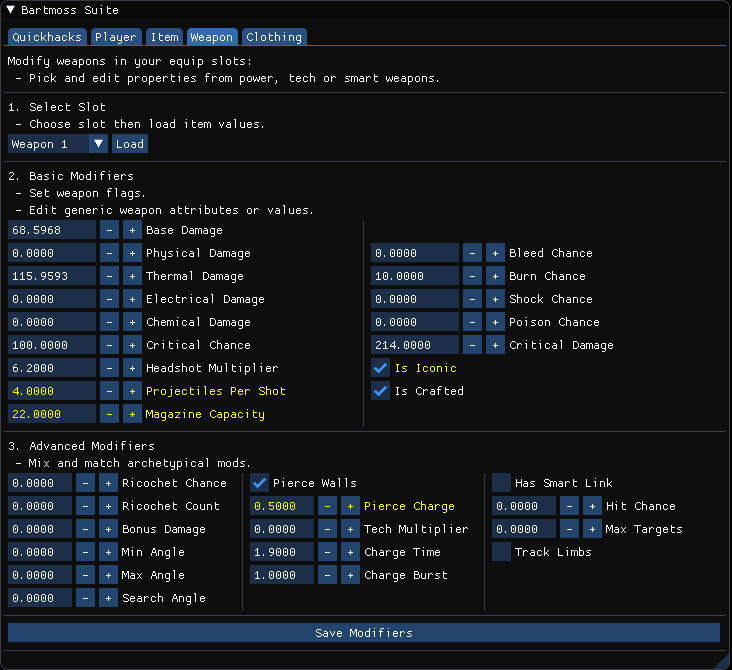

# Bartmoss Suite
A suite of Lua scripts to simplify interaction with the Cyberpunk 2077 console.

Bartmoss lets you:
 - Control item stats such as quality (rarity), item level or weapon damage and effects.
 - Give the player new items with these controls.
 - Modify existing items in the player's inventory.
 - Easily find and reference items by name instead of obscure hashes.
 - Do all this through a simple UI in-game!




In future Bartmoss may let you:
 - Control weapon and attachment skins.

## Documentation
 - [Interface](docs/INTERFACE.md)
 - [Glossary](docs/GLOSSARY.md)
 - [Frequently Asked Questions](docs/FAQ.md)

## Requirements
 - Cyberpunk 2077 (version 1.11.0)
 - [CyberEngineTweaks](https://github.com/yamashi/CyberEngineTweaks) (version 1.9.5+)

## Installation
```bash
$ git clone https://github.com/xant-tv/bartmoss
```
Place `bartmoss` directory into `\bin\x64\plugins\cyber_engine_tweaks\mods\` within your Cyberpunk 2077 install location.

## In-Game Console
```lua
-- Hook the mod in the console.
Bartmoss = GetMod("bartmoss")
```
All [interfaces](docs/INTERFACE.md) will now be available.

## Credits
Huge thanks to the community of amazing netrunners working on [CET](https://github.com/yamashi/CyberEngineTweaks), [RED4ext](https://github.com/WopsS/RED4ext) and not [one](https://github.com/PixelRick/CyberpunkSaveEditor), but [two](https://github.com/WolvenKit/CyberCAT) save editors. 
Without you, this would not have been possible. 
Check out the modding [Discord](https://discord.gg/cp77modding).